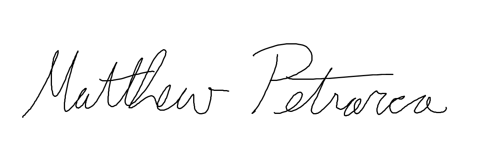
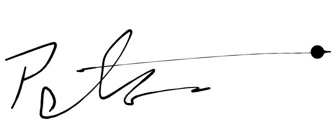

# Contributor Covenant Code of Conduct

## Our Pledge

We as members, contributors, and leaders pledge to make participation in our
community a harassment-free experience for everyone, regardless of age, body
size, visible or invisible disability, ethnicity, sex characteristics, gender
identity and expression, level of experience, education, socio-economic status,
nationality, personal appearance, race, caste, color, religion, or sexual
identity and orientation.

We pledge to act and interact in ways that contribute to an open, welcoming,
diverse, inclusive, and healthy community.

## Our Standards

Examples of behavior that contributes to a positive environment for our
community include:

* Demonstrating empathy and kindness toward other people
* Being respectful of differing opinions, viewpoints, and experiences
* Giving and gracefully accepting constructive feedback
* Accepting responsibility and apologizing to those affected by our mistakes,
  and learning from the experience
* Focusing on what is best not just for us as individuals, but for the overall
  community

Examples of unacceptable behavior include:

* The use of sexualized language or imagery, and sexual attention or advances of
  any kind
* Trolling, insulting or derogatory comments, and personal or political attacks
* Public or private harassment
* Publishing others' private information, such as a physical or email address,
  without their explicit permission
* Other conduct which could reasonably be considered inappropriate in a
  professional setting

## Enforcement Responsibilities

Community leaders are responsible for clarifying and enforcing our standards of
acceptable behavior and will take appropriate and fair corrective action in
response to any behavior that they deem inappropriate, threatening, offensive,
or harmful.

Community leaders have the right and responsibility to remove, edit, or reject
comments, commits, code, wiki edits, issues, and other contributions that are
not aligned to this Code of Conduct, and will communicate reasons for moderation
decisions when appropriate.

## Scope

This Code of Conduct applies within all community spaces, and also applies when
an individual is officially representing the community in public spaces.
Examples of representing our community include using an official email address,
posting via an official social media account, or acting as an appointed
representative at an online or offline event.

## Enforcement

Instances of abusive, harassing, or otherwise unacceptable behavior may be
reported to the community leaders responsible for enforcement in the [team discord](https://discord.com/channels/1292834599029837827/1292834599713636404).
All complaints will be reviewed and investigated promptly and fairly.

All community leaders are obligated to respect the privacy and security of the
reporter of any incident.

## Enforcement Guidelines

Community leaders will follow these Community Impact Guidelines in determining
the consequences for any action they deem in violation of this Code of Conduct:

### 1. Correction

**Community Impact**: Use of inappropriate language or other behavior deemed
unprofessional or unwelcome in the community.

**Consequence**: A private, written warning from community leaders, providing
clarity around the nature of the violation and an explanation of why the
behavior was inappropriate. A public apology may be requested.

### 2. Warning

**Community Impact**: A violation through a single incident or series of
actions.

**Consequence**: A warning with consequences for continued behavior. No
interaction with the people involved, including unsolicited interaction with
those enforcing the Code of Conduct, for a specified period of time. This
includes avoiding interactions in community spaces as well as external channels
like social media. Violating these terms may lead to a temporary or permanent
ban.

### 3. Temporary Ban

**Community Impact**: A serious violation of community standards, including
sustained inappropriate behavior.

**Consequence**: A temporary ban from any sort of interaction or public
communication with the community for a specified period of time. No public or
private interaction with the people involved, including unsolicited interaction
with those enforcing the Code of Conduct, is allowed during this period.
Violating these terms may lead to a permanent ban.

### 4. Permanent Ban

**Community Impact**: Demonstrating a pattern of violation of community
standards, including sustained inappropriate behavior, harassment of an
individual, or aggression toward or disparagement of classes of individuals.

**Consequence**: A permanent ban from any sort of public interaction within the
community.

## Project-specific Guidelines

### 1. Decisions
**Community Standard**: All major project decisions, including technical choices, design directions, and feature implementations, should be made through group consensus.  
**Consequence**: Any member making unilateral decisions without consulting the team will be reminded to follow the collaborative process. Persistent behavior may result in loss of decision-making privileges for a period.

### 2. Attendance
**Community Standard**: Members are expected to attend all scheduled meetings. If a member cannot attend, they must notify the team in advance and review the meeting notes to stay updated.  
**Consequence**: Failure to attend meetings without prior notice may result in limited participation in decision-making for the missed period. Chronic absences may lead to removal from key responsibilities.

### 3. Assignments
**Community Standard**: Tasks should be completed within the agreed-upon timeframe. If challenges arise, the member should communicate them early to seek assistance or reassignment.  
**Consequence**: Missing deadlines without communication may result in reassignment of tasks or a reduced role in upcoming sprints.

### 4. Participation
**Community Standard**: Every member is encouraged to contribute to discussions, voice ideas, and engage with others’ suggestions constructively.  
**Consequence**: Lack of participation or engagement without valid reasons may lead to reduced involvement in key decisions.

### 5. Meeting Times and Locations
**Community Standard**: Meetings will be held at times agreed upon by all members and may take place in person or online. Flexibility and punctuality are encouraged.  
**Consequence**: Members consistently late to meetings will receive a warning, and repeated offenses may lead to reduced involvement in certain tasks.

### 6. Agenda and Meeting Notes
**Community Standard**: Each meeting will have a predetermined agenda and a designated member will take notes to be shared with the group afterward.  
**Consequence**: Failure to follow the agenda or incomplete note-taking may result in reassignment of meeting facilitation responsibilities.

### 7. Promptness
**Community Standard**: Team members are expected to deliver their work on time and provide timely feedback during reviews.  
**Consequence**: Chronic delays may result in fewer assigned tasks and limited involvement in upcoming sprints.

### 8. Conversational Courtesies
**Community Standard**: During discussions, respect for others' speaking time is essential. Avoid interruptions and listen attentively before responding.  
**Consequence**: Disruptive behavior during discussions will lead to a private warning. Continued disruptions may result in limited speaking time or reduced decision-making involvement.

### 9. Enforcement/Feedback
**Community Standard**: Feedback on behavior or performance should be constructive and handled in a respectful, solution-oriented manner.  
**Consequence**: Negative, hostile, or unconstructive feedback may result in mediation by team leaders, and consistent issues may lead to a reduced role within the group.

## Revision of Code

This code of conduct is subject to revision under special circumstances determined by the group 
as a whole. Any changes must be approved by all active members.

## Team Member Signatures:

## Attribution

This Code of Conduct is adapted from the [Contributor Covenant][homepage],
version 2.1, available at
[https://www.contributor-covenant.org/version/2/1/code_of_conduct.html][v2.1].

Community Impact Guidelines were inspired by
[Mozilla's code of conduct enforcement ladder][Mozilla CoC].

For answers to common questions about this code of conduct, see the FAQ at
[https://www.contributor-covenant.org/faq][FAQ]. Translations are available at
[https://www.contributor-covenant.org/translations][translations].

[homepage]: https://www.contributor-covenant.org
[v2.1]: https://www.contributor-covenant.org/version/2/1/code_of_conduct.html
[Mozilla CoC]: https://github.com/mozilla/diversity
[FAQ]: https://www.contributor-covenant.org/faq
[translations]: https://www.contributor-covenant.org/translations
